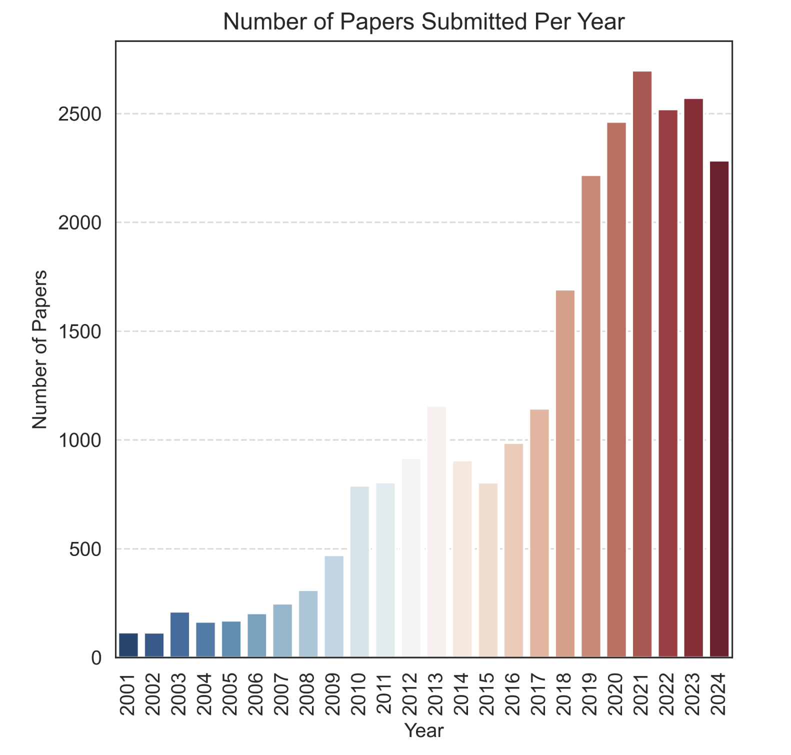
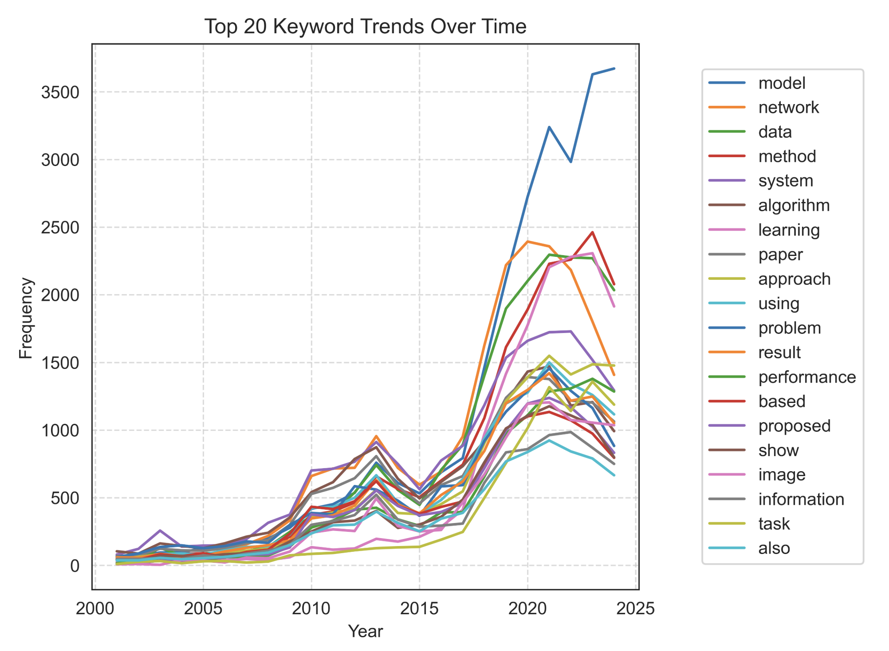
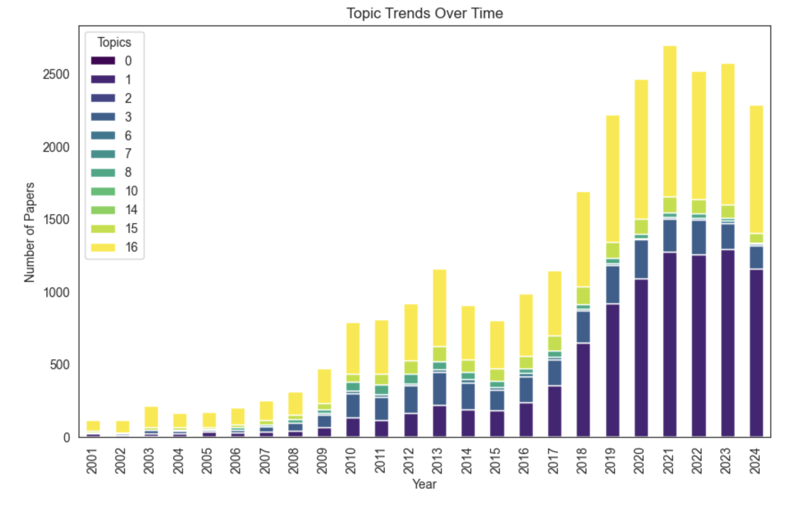
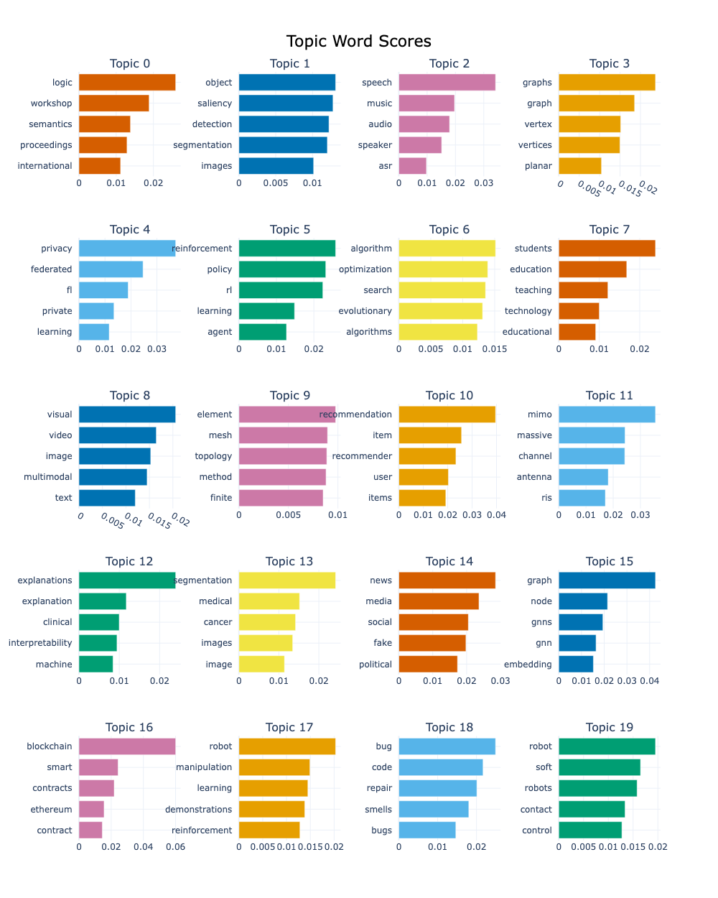
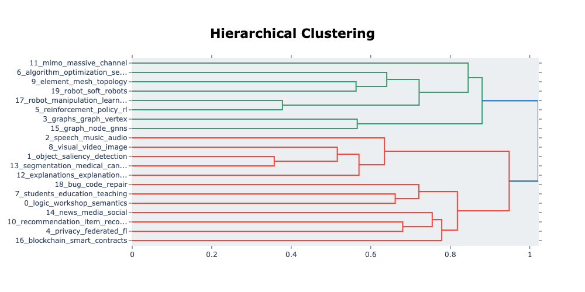
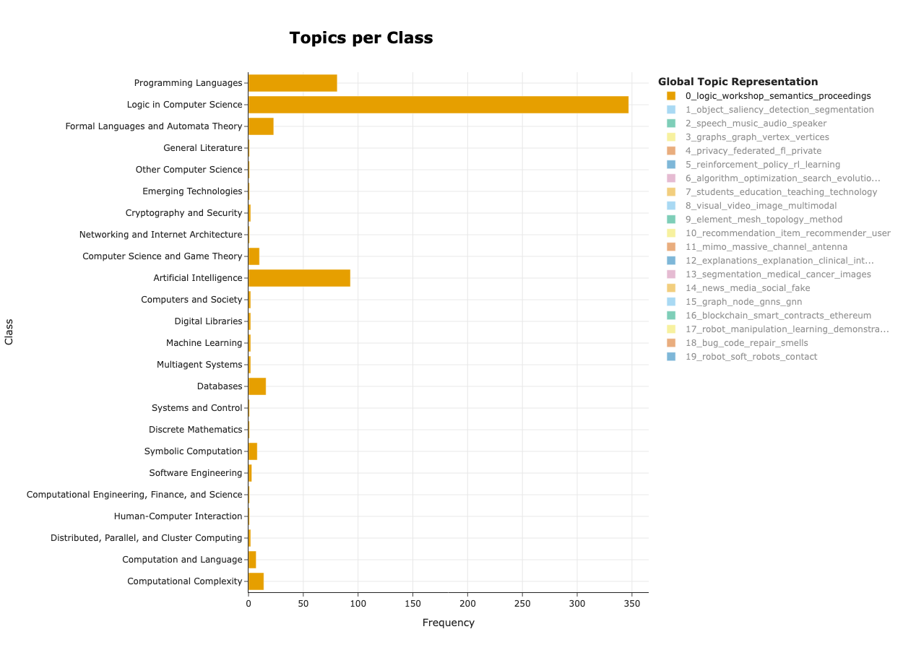
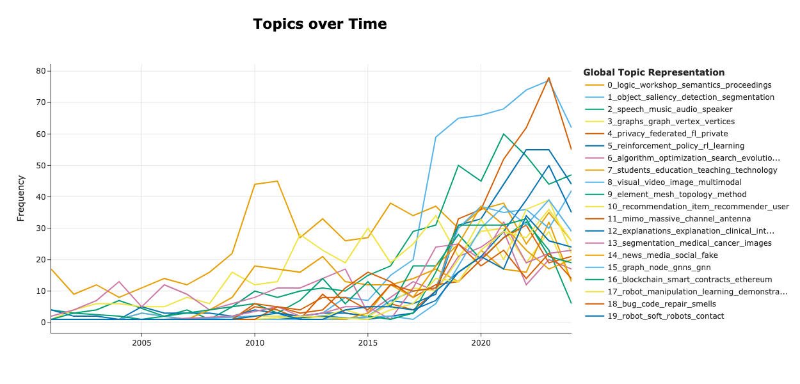

# Temporal Topic Modeling on Research Papers

To analyze how research topics evolve over time by applying temporal topic modeling on a dataset of research papers and enhance insights through network analysis of citation dynamics.

## Table of contents

1. Introduction
    - 1.1. Purpose of the project
    - 1.2. Main assumptions
1. Dataset Collection
1. Model: LDA
    - 3.1. Exploratory Data Analysis
    - 3.2. Temporal Topic Modeling
    - 3.3. Evaluation of LDA
1. Model: BertTopic
    - 4.1. BertTopic Word Scores Analysis
    - 4.2. BertTopic Hierarchical Cluster
    - 4.3. Topic Per Cluster
    - 4.4. Temporal Topic Modeling
    - 4.5. Evaluation of BertTopic
1. Overall Summary and Comparison Between LDA and BERTopic

### 1.1. Purpose of the project

The objective of this project is to explore and analyze how research topics in `Computer Science` field of study have changed throughout time. with the use of `Topic Modeling` methods like `LDA` and `BertTopic`. The project's goal is to comprehend the rise and fall of various subjects.

### 1.2. Main assumptions

- BertTopic Modeling is better than LDA.
- How have topics emerged, evolved, or declined over time?
- What are the influential topics over the time?

### 2. Dataset Collection

**Data Source:**

- arXiv: Use the API to fetch metadata and abstracts from selected categories (e.g., cs.AI, stat.ML)
- Download Link: [https://www.kaggle.com/datasets/Cornell-University/arxiv](https://www.kaggle.com/datasets/Cornell-University/arxiv)

## 3. Model: LDA

### 3.1. Exploratory Data Analysis

**Temporal analysis:** The temporal analysis of papers publish each year showing that the lowest papers (around 250 each year) were published in between 2001 and 2007. From 2009 the papers publication increased significantly by each year. In the year of 2015 has been declined but again from around 2017 publication increased significantly.

### 3.2. Temporal Topic Modeling

**Topic trend analysis:** Here I calculated the top 20 most frequently used topic in Abstract of the papers. The trend plot showing that `model`, `network`, `data`, `systems` and `algorithm` are the most dominated topics and has the highest trend over the time and other topic also trending significantly.

### 3.3. Evaluation of LDA

**Dominant Topic:** Dominant Topic: Throughout the entire period from 2019 to 2024, topic 0 1 is consistently the most prevalent topic. It experiences substantial growth, especially in the later years, contributing significantly to the overall increase in publications.

**Emerging Topics:** While Topic 3 and 6 dominates, other topics like 7, and 8 also show noticeable growth, particularly towards the end of the period. This suggests increasing interest or research focus shifting towards these areas.

## 4. Model: BertTopic

### 4.1. BertTopic Word Scores Analysis

From a glance, the most frequent topics seem to have coherent and clear topic representations. Interpretation of these clusters is much easier if you are familiar with the content of the documents. \
For example, to me, Topic 0 is seems to be about `Logic and Programming` and Topic 1 seems to be clearly about anything `Social Media and Sentiment Analysis`.

For every topic, we generated 5 words that best capture that subject. Is 5 words enough, though? Is it possible to have a good topic representation in just 1 word?

We may illustrate the drop in term score with the addition of terms to get a sense of the number of words required to have adequate topic representation. Since the first term is the best for the topic, the notion here is that each new word has a lower term score than the one before it. The elbow-method utilized in k-NN is extremely similar to the point of diminishing returns that we eventually reach. The drop in term score while adding terms per topic is shown below.

According to the elbow technique, each topic may be adequately represented with three words. After then, any additional words we use seem to have little impact.

### 4.2. BertTopic Hierarchical Cluster

The distance between subjects reveals the commonalities between them. Two plots, however, can help us better perceive and comprehend the similarities between themes and provide additional information. Specifically, illustrating the potential topic hierarchy and associated matrix of similarity.

The dendrogram demonstrates the clustering of related topics based on their embeddings. Closely related topics are grouped (e.g., `Reinforcement Learning` and `Graph Node Analysis`).

Hierarchical clustering reveals thematic overlaps and dependencies between topics. Clustering helps identify broader themes or umbrella topics in the dataset.

### 4.3. Topic Per Cluster

The categories listed for every paper. Is it possible to determine which subjects are commonly included in particular categories? Generally speaking, topic modeling finds more subjects than the previously established categories. This aids in the identification and comprehension of certain subcategories that may be present in the data.

Dominant categories include `Artificial Intelligence`, `Logic in Computer Science`, and `Machine Learning`, reflecting the dataset's focus. Some categories (e.g., "Human-Computer Interaction" and "Cryptography") have fewer associated topics, indicating niche areas.

### 4.4. Temporal Topic Modeling

We can observe some intriguing patterns emerging from the aforementioned visualization. Specifically, from 2001 to 2015, a number of topics appear almost same numbers of papers submitted by each year. Interstgly around from 2017 increased the paper submission almost in each topic. Topics 1, 2, 4 and 5, for instance, appeared to be popular.

### 4.5. Evaluation of BertTopic

BERTopic is a powerful tool for analyzing evolving research trends and understanding topic interrelations. Its integration of temporal analysis and hierarchical clustering makes it particularly suitable for datasets like research papers. However, careful tuning and resource allocation are necessary to mitigate its computational demands and ensure robust results.

### 5. Overall Summary and Comparison Between LDA and BERTopic

This project goals to explore and analyse the trends of the research topics over the time periods. Assumtions were that BertTopic is better than LDA which is true based on the analysis above. We also analyzed the temporal analysis of the research topic over the times and identified the most trending topic in `COmputer Science` research domain.

We selected the BertTopic model based on the following comparison.

The best tool for examining changing research topics is BERTopic, particularly when dealing with intricate datasets and emphasizing temporal and hierarchical insights. Its usage for this project is justified by its robust features and richer outcomes, even though it has a greater computing cost.

- **High Topic Coherence:** BERTopic improves interpretability by making topics that are more  significance.
- **Temporal Topic Modeling:** The project's objective of analyse research trends which is aligned with the model and show topic trend across time.
- **Interpretability:** Provides word and document embeddings that make topics easier to interpret than LDA.
- **Rich Visualizations:** The integrated tools in BERTopic offer a more logical and perceptive depiction of the data, improving the analysis.
- **Hierarchical Clustering:** LDA cannot offer the level of insights that can be gained by investigating connections between themes.
