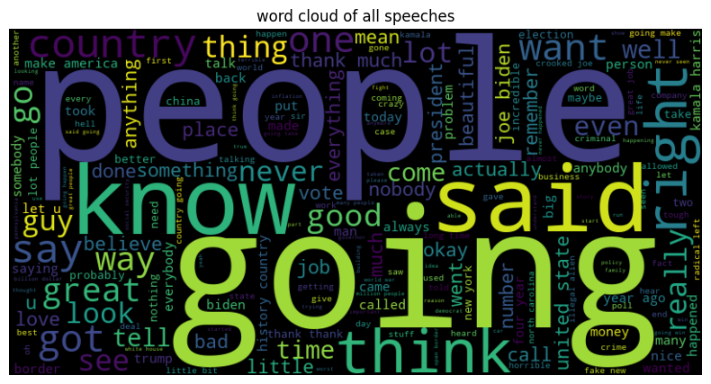
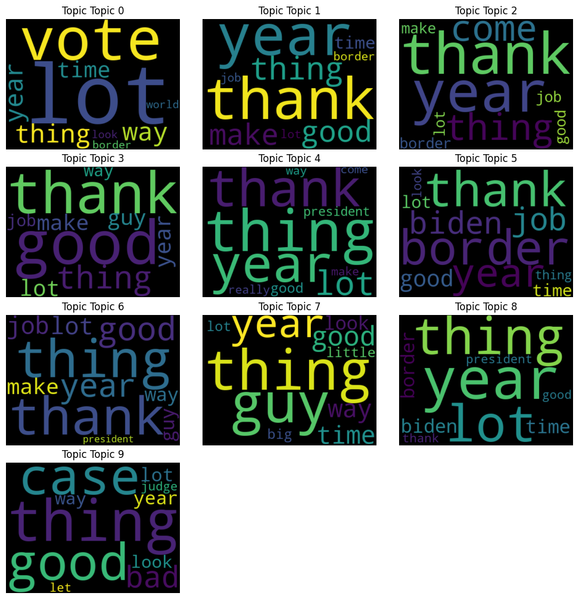

# **Sentiment and Topic Analysis of Trump's 2024 Campaign Speeches**

---
This project aims to analyze the speeches delivered by [Donald Trump during his 2024 campaign](https://www.kaggle.com/datasets/perceptron90/donald-trump-2024-transcripts) across various states. The analysis focuses on sentiment detection and topic categorization, highlighting trends in campaign rhetoric and public messaging. The speeches are categorized into key campaign topics, including Gun Laws, Climate, Crime, Healthcare, Taxes, Ukraine Aid, Abortion, Immigration, and Economy.

By leveraging advanced text mining and natural language processing (NLP) techniques, the project provides insights into:
- Sentiment trends across states and topics.
- Speech patterns and campaign strategies tailored to specific regions.
- Key themes and topics emphasized in the campaign.

## **Table of Contents**:
1. [Project Objectives](#project-objectives)  
2. [Data Collection](#data-collection)  
3. [Methodology](#methodology)  
4. [Sentiment Analysis](#sentiment-analysis)  
5. [Topic Categorization](#topic-categorization)  
6. [Text Clustering](#text-clustering)  
7. [Network Graphs](#network-graphs)  

---

### **1. Project Objectives**
- Perform sentiment analysis on the campaign speeches.  
- Categorize speech content into predefined topics.  
- Explore trends in sentiment and topics across states and over time.  
- Provide visualizations and insights for deeper understanding.

---

### **2. Data Collection**
- **Source**: Transcripts of speeches delivered by Trump in 2024 during his campaign events.  
- **Metadata**: Information about the speech's location (state), date, and associated campaign topics.  
- **Data Format**: Cleaned text data with associated metadata in a CSV format.

---

### **3. Methodology**
1. **Preprocessing**:
   - Text cleaning: Removing stopwords, special characters, and URLs.  
   - Tokenization and normalization: Breaking text into tokens and converting them to a standard format.  

The words "people," "know," "going," "great," "way," "right," "county," and "good" frequently appear in Trump's 2024 campaign speeches, aligning with his ideology of Making America Great Again.

2. **Exploratory Data Analysis (EDA) and Sentiment Analysis**:
   - Analyze and visualize sentiment and topic trends over time and across states.  
   - Generate word clouds and N-gram analyses for insights.
   - Use pre-trained sentiment analysis models like VADER.  
   - Categorize sentiments as Positive, Neutral, or Negative.

By using sentiment analysis, one can discover his tone by time and states:

One can observe how his speeches evolved during the election campaign. There is a probability of an increase in negative speeches starting from September 23, 2024.

We need to look at his speeches' sentiment by location:

Donald Trump has been campaigning in key swing states like New York, Las Vegas, Arizona, Wisconsin, and Michigan, where he has made negative remarks about his opponent, Kamala Harris. These states are crucial for both candidates in the 2024 presidential election.

---

### **4. Topic Categorization**
- Supervised classification for predefined topics.
- Unsupervised topic modeling (e.g., LDA, BERTopic) to detect hidden themes.  

Let's look at which campaign topics he covered in his speeches versus the locations he delivered them. I used predefined topics on his campaign:

He mainly pay attention to Immigration, and Ukraine also Tax was on his speeches on his "loyal" states.

Using BERTopic word scoring analysis:

In his speeches, he covered 7 topics according to the BERTopic model. In topics 2 and 6, he put more pressure on his opponent Kamala Harris and Joe Biden. Meanwhile, he covered border issues and possibly inflation or taxes.

---

### **5. Text Clustering**
- Group similar speeches using clustering algorithms like KMeans and visualize them.

Using Kmeans and Sentiment transformer "all-MiniLM-L6-v2" model,10 topics of cluster were created. here is word clouds of each cluster:

---

### **6. Network Graphs**
- Analyze connections between key terms and entities in the speeches.

Biden node and its connection words in Trump's speech:

How did Trump react to Russia? 

Borders versus Taxes:

One notice how Tax node connected with other campaign topic and other coutry porblems such as border, legal and immigration