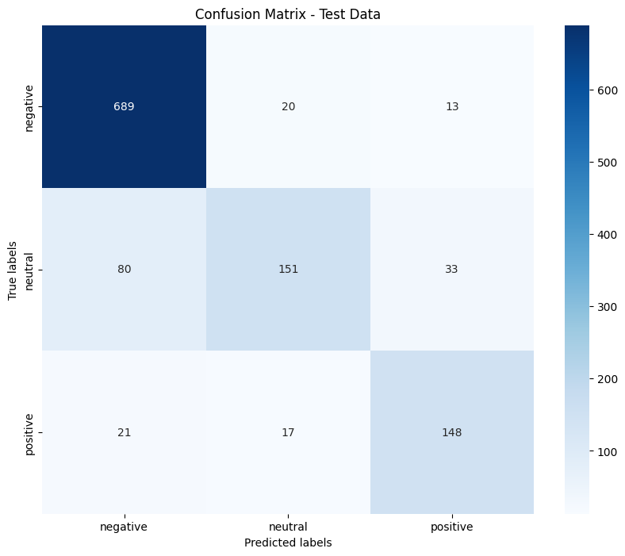

## Project Overview
The objective of this project is to explore and analyze how customers sentiment have been changed throughout time. with the use of sentiment analysis algorithms like VADER and BERT

## Table of contents

0. Introduction
    1. Purpose of the project
    2. Main assumptions
1. Installing required packages
2. Dataset
    1. Dataset Collection
    2. Preprocessing
    3. Exploratory Data Analysis (EDA)
3. Lexicon-Based Sentiment Analysis
	1. Vader Sentiment Distribution
	2. Positive wordcloud
	3. Negative wordcloud
	4. Evaluating VADER's prediction
	5. VADER is a VALENCE based Sentiment Analysis Summary
4. Supervised Machine Learning Approach
    1. Traing, Validation and Test dataset spliting
5. Comparison of Methods
    1. Overall Comparison of Sentiment Analysis Summary using both methods
    2. Conclusion

## 0. Introduction
### 0.1. Purpose of the project.
Provide a concise introduction to sentiment analysis of airline customers using lexicon-based (VADER) and supervised learning (BERT) algorithms and compare the results. Include visualizations and summary statistics to understand the distribution of sentiments (positive, negative, neutral).

### 0.2. Main assumptions
- BERT Model is better than VADER.
- How have sentiment emerged, evolved, or declined over time?

## 2. Dataset

### 2.1. Dataset Collection

Data Source:
In this sentiment analysis project I used the huggingface [twitter-airline-sentiment](https://huggingface.co/datasets/osanseviero/twitter-airline-sentiment) dataset. \
Download Link: [Twitter Airline Sentiment](https://huggingface.co/datasets/osanseviero/twitter-airline-sentiment)

### 2.2. Processing

Check null values in `text` column and created a new column `tweet_created_date` from `tweet_created` column.

### 2.3. Exploratory Data Analysis (EDA)
- Include visualizations and summary statistics to understand the distribution of sentiments (positive, negative, neutral).


    

This bar chart shows the sentiment distribution (negative, neutral, positive) among various airlines in the Twitter Airline Sentiment dataset:

- **Negative Sentiment (blue)** dominates across all airlines, especially for United and American, which have the highest volume of negative tweets.
- **Neutral Sentiment (orange)** is modest and relatively stable among airlines.
- **Positive Sentiment (green)** is the lowest among all airlines, with Virgin America showing a little higher volume of positive tweets compared to its competitors.

This highlights an ongoing pattern of frustration, that includes significant variations in sentiment intensity among airlines.
 


This line chart shows the temporal distribution of sentiment (negative, neutral, positive) within the Twitter Airline Sentiment dataset. Key observations include:  

1. **Negative sentiment** dominates across the period of time, with a significant peak on 2015-02-22, signifying an increase in complaints or dissatisfaction.  
1. **Neutral sentiment** stays rather stable, with a modest increase during the same period.
1. **Positive sentiment** shows minimal activity, with a small increase seen between February 22 and February 23, 2015, however it stays continuously low.

The chart shows an evident tendency towards negative feedback over this timeframe, with significant peaks maybe associated with particular events or situations.

<div>
<style scoped>
    .dataframe tbody tr th:only-of-type {
        vertical-align: middle;
    }

    .dataframe tbody tr th {
        vertical-align: top;
    }

    .dataframe thead th {
        text-align: right;
    }
</style>
<table border="1" class="dataframe">
  <thead>
    <tr style="text-align: right;">
      <th></th>
      <th>airline_sentiment</th>
      <th>airline</th>
      <th>text</th>
      <th>tweet_created_date</th>
      <th>cleaned_text</th>
    </tr>
  </thead>
  <tbody>
    <tr>
      <th>0</th>
      <td>neutral</td>
      <td>Virgin America</td>
      <td>@VirginAmerica What @dhepburn said.</td>
      <td>2015-02-24</td>
      <td>what said</td>
    </tr>
    <tr>
      <th>1</th>
      <td>positive</td>
      <td>Virgin America</td>
      <td>@VirginAmerica plus you've added commercials t...</td>
      <td>2015-02-24</td>
      <td>plus you ve added commercials to the experien...</td>
    </tr>
    <tr>
      <th>2</th>
      <td>neutral</td>
      <td>Virgin America</td>
      <td>@VirginAmerica I didn't today... Must mean I n...</td>
      <td>2015-02-24</td>
      <td>i didn t today must mean i need to take anoth...</td>
    </tr>
    <tr>
      <th>3</th>
      <td>negative</td>
      <td>Virgin America</td>
      <td>@VirginAmerica it's really aggressive to blast...</td>
      <td>2015-02-24</td>
      <td>it s really aggressive to blast obnoxious ent...</td>
    </tr>
    <tr>
      <th>4</th>
      <td>negative</td>
      <td>Virgin America</td>
      <td>@VirginAmerica and it's a really big bad thing...</td>
      <td>2015-02-24</td>
      <td>and it s a really big bad thing about it</td>
    </tr>
  </tbody>
</table>
</div>


<div>
<style scoped>
    .dataframe tbody tr th:only-of-type {
        vertical-align: middle;
    }

    .dataframe tbody tr th {
        vertical-align: top;
    }

    .dataframe thead th {
        text-align: right;
    }
</style>
<table border="1" class="dataframe">
  <thead>
    <tr style="text-align: right;">
      <th></th>
      <th>airline_sentiment</th>
      <th>airline</th>
      <th>text</th>
      <th>tweet_created_date</th>
      <th>cleaned_text</th>
    </tr>
  </thead>
  <tbody>
    <tr>
      <th>0</th>
      <td>neutral</td>
      <td>Virgin America</td>
      <td>@VirginAmerica What @dhepburn said.</td>
      <td>2015-02-24</td>
      <td>said</td>
    </tr>
    <tr>
      <th>1</th>
      <td>positive</td>
      <td>Virgin America</td>
      <td>@VirginAmerica plus you've added commercials t...</td>
      <td>2015-02-24</td>
      <td>plus added commercials experience tacky</td>
    </tr>
    <tr>
      <th>2</th>
      <td>neutral</td>
      <td>Virgin America</td>
      <td>@VirginAmerica I didn't today... Must mean I n...</td>
      <td>2015-02-24</td>
      <td>today must mean need take another trip</td>
    </tr>
    <tr>
      <th>3</th>
      <td>negative</td>
      <td>Virgin America</td>
      <td>@VirginAmerica it's really aggressive to blast...</td>
      <td>2015-02-24</td>
      <td>really aggressive blast obnoxious entertainmen...</td>
    </tr>
    <tr>
      <th>4</th>
      <td>negative</td>
      <td>Virgin America</td>
      <td>@VirginAmerica and it's a really big bad thing...</td>
      <td>2015-02-24</td>
      <td>really big bad thing</td>
    </tr>
  </tbody>
</table>
</div>


## 3. Lexicon-Based Sentiment Analysis

Apply the lexicon-based (VADER) method to the dataset to predict customers sentiment.

<div>
<style scoped>
    .dataframe tbody tr th:only-of-type {
        vertical-align: middle;
    }

    .dataframe tbody tr th {
        vertical-align: top;
    }

    .dataframe thead th {
        text-align: right;
    }
</style>
<table border="1" class="dataframe">
  <thead>
    <tr style="text-align: right;">
      <th></th>
      <th>airline_sentiment</th>
      <th>airline</th>
      <th>text</th>
      <th>tweet_created_date</th>
      <th>cleaned_text</th>
      <th>vader_score</th>
    </tr>
  </thead>
  <tbody>
    <tr>
      <th>0</th>
      <td>neutral</td>
      <td>Virgin America</td>
      <td>@VirginAmerica What @dhepburn said.</td>
      <td>2015-02-24</td>
      <td>said</td>
      <td>0.0000</td>
    </tr>
    <tr>
      <th>1</th>
      <td>positive</td>
      <td>Virgin America</td>
      <td>@VirginAmerica plus you've added commercials t...</td>
      <td>2015-02-24</td>
      <td>plus added commercials experience tacky</td>
      <td>0.0000</td>
    </tr>
    <tr>
      <th>2</th>
      <td>neutral</td>
      <td>Virgin America</td>
      <td>@VirginAmerica I didn't today... Must mean I n...</td>
      <td>2015-02-24</td>
      <td>today must mean need take another trip</td>
      <td>0.0000</td>
    </tr>
    <tr>
      <th>3</th>
      <td>negative</td>
      <td>Virgin America</td>
      <td>@VirginAmerica it's really aggressive to blast...</td>
      <td>2015-02-24</td>
      <td>really aggressive blast obnoxious entertainmen...</td>
      <td>-0.3306</td>
    </tr>
    <tr>
      <th>4</th>
      <td>negative</td>
      <td>Virgin America</td>
      <td>@VirginAmerica and it's a really big bad thing...</td>
      <td>2015-02-24</td>
      <td>really big bad thing</td>
      <td>-0.5829</td>
    </tr>
  </tbody>
</table>
</div>


<div>
<style scoped>
    .dataframe tbody tr th:only-of-type {
        vertical-align: middle;
    }

    .dataframe tbody tr th {
        vertical-align: top;
    }

    .dataframe thead th {
        text-align: right;
    }
</style>
<table border="1" class="dataframe">
  <thead>
    <tr style="text-align: right;">
      <th></th>
      <th>airline_sentiment</th>
      <th>airline</th>
      <th>text</th>
      <th>tweet_created_date</th>
      <th>cleaned_text</th>
      <th>vader_score</th>
      <th>vader_senti_predict</th>
    </tr>
  </thead>
  <tbody>
    <tr>
      <th>0</th>
      <td>neutral</td>
      <td>Virgin America</td>
      <td>@VirginAmerica What @dhepburn said.</td>
      <td>2015-02-24</td>
      <td>said</td>
      <td>0.0000</td>
      <td>negative</td>
    </tr>
    <tr>
      <th>1</th>
      <td>positive</td>
      <td>Virgin America</td>
      <td>@VirginAmerica plus you've added commercials t...</td>
      <td>2015-02-24</td>
      <td>plus added commercials experience tacky</td>
      <td>0.0000</td>
      <td>negative</td>
    </tr>
    <tr>
      <th>2</th>
      <td>neutral</td>
      <td>Virgin America</td>
      <td>@VirginAmerica I didn't today... Must mean I n...</td>
      <td>2015-02-24</td>
      <td>today must mean need take another trip</td>
      <td>0.0000</td>
      <td>negative</td>
    </tr>
    <tr>
      <th>3</th>
      <td>negative</td>
      <td>Virgin America</td>
      <td>@VirginAmerica it's really aggressive to blast...</td>
      <td>2015-02-24</td>
      <td>really aggressive blast obnoxious entertainmen...</td>
      <td>-0.3306</td>
      <td>negative</td>
    </tr>
    <tr>
      <th>4</th>
      <td>negative</td>
      <td>Virgin America</td>
      <td>@VirginAmerica and it's a really big bad thing...</td>
      <td>2015-02-24</td>
      <td>really big bad thing</td>
      <td>-0.5829</td>
      <td>negative</td>
    </tr>
  </tbody>
</table>
</div>


### 3.1. Vader Sentiment Distribution
    


The bar chart represents the sentiment distribution from the Twitter Airline Sentiment dataset analyzed using VADER. It shows that the majority of tweets (~8,000) are negative, reflecting significant dissatisfaction among customers. \
A smaller portion (~2,000) is neutral, likely representing objective or informational content, while the least (~1,500) are positive, indicating limited public praise for airlines. This highlights a predominantly negative perception of airlines on Twitter.

airline_sentiment
negative    9178
neutral     3099
positive    2363
Name: count, dtype: int64


**VADER Sentiment Counts:**

negative    9361
neutral     2950
positive    2329
Name: count, dtype: int64


### 3.2. Positive wordcloud


### 3.3. Negative wordcloud


### 3.4. Evaluating VADER's prediction

 Compare results to labeled data using metrics like accuracy, precision, recall, and F1-score.

```bash
Accuracy: 0.60724043715847
Precision: 0.6016320833870709
Recall: 0.60724043715847
F1-score: 0.6043547462415132
```


**The model's performance on the sentiment prediction task is as follows:**

- **Accuracy**: The model correctly predicted the sentiment in approximately 60.7% of the cases.
- **Precision**: The weighted precision score is 60.2%, meaning that when the model predicted a positive sentiment, 60.2% of those predictions were correct.
- **Recall**: The model's recall score is 60.7%, indicating that it correctly identified 60.7% of the positive sentiments in the data.
- **F1-Score**: The F1-score is 60.4%, which balances precision and recall, suggesting a moderate performance in terms of both identifying positive sentiment and minimizing false positives.

Overall, the model demonstrates a moderate level of accuracy and performance across these metrics.

### 3.5. VADER is a VALENCE based Sentiment Analysis Summary
Based on the sentiment analysis performed using the VADER sentiment analysis tool on the tweets in the dataset, the distribution of sentiments is as follows:

**Sentiment Stats: Actual vs Vader Prediction**
| Sentiment     | Actual Tweets | Vader Predicted Tweets |
|---------------|---------------|-------------------------|
| Positive      | 2363          | 2339                   |
| Negative      | 9178          | 9352                   |
| Neutral       | 3099          | 2949                   |


**Summary:**

- Positive Sentiment: Vader predict 2339 tweets are positive while 2363 actually positive. These tweets express satisfaction, support, or other positive emotions. This indicates that a smaller portion of the tweets reflect positive opinions or sentiments.

- Negative Sentiment: The majority of the tweets 9352, Vader predicted as negative while actuall are 9178. This indicates a significant amount of dissatisfaction, criticism, or other negative emotions expressed by the users. This suggests that the topics discussed in these tweets are largely viewed unfavorably by the users.

- Neutral Sentiment: There are 2949 tweets classified as neutral by Vader but actual 3099 tweets are neutral. These tweets do not express a strong positive or negative sentiment. They might be factual statements, news updates, or other content that does not convey a clear opinion.

Conclusion: 

### **4. Supervised Machine Learning Approach**

- **Algorithm Selection**: Justify the choice of BERT algorithm.

### 4.1. Traing, Validation and Test dataset spliting

- **Training:** 70% of dataset used to training the model
- **Validation:** 20% of dataset used to validate the model
- **Test:** 10% of dataset used to test the model


- **Feature Extraction**:
  - Traditional Methods: Use Bag of Words (BoW) or TF-IDF.
  - Advanced Methods: Use word embeddings like Word2Vec, GloVe or BERT.

- **Model Training and Testing**:
  - Train the model on the dataset.
  - Perform hyperparameter tuning using methods like GridSearchCV or RandomizedSearchCV.


### Evaluation
Report metrics such as accuracy, precision, recall, F1-score, and ROC-AUC.

### Training Metrics

Accuracy: 0.9019924098671727
Precision: 0.9007408665976626
Recall: 0.9019924098671727
F1-score: 0.8992059035667117


### Validation Metrics

Accuracy: 0.8415300546448088
Precision: 0.837416483631053
Recall: 0.8415300546448088
F1-score: 0.8369190760678528


### Testing Metrics

Accuracy: 0.60724043715847
Precision: 0.6016320833870709
Recall: 0.60724043715847
F1-score: 0.6043547462415132


    


## 5. Comparison of Methods

### 5.1. Overall Comparison of Sentiment Analysis Summary using both methods

The analysis demonstrates that while both VADER and BERT perform well in identifying the predominance of negative sentiment in the tweets dataset, BERT consistently achieves higher metrics (accuracy, precision, recall, and F1 score). This suggests that BERT provides a more robust approach to sentiment analysis compared to VADER, likely due to its deep learning architecture and contextual understanding.

However, to enhance the insights, clustering and topic modeling could be applied to uncover key themes within the dataset. Combining these methods with sentiment analysis would provide a richer understanding of the sentiment associated with each theme, offering deeper insights into the dataset's context and public opinion.

### 5.2. Conclusion

BERT outperforms VADER in sentiment analysis, showing higher accuracy, precision, recall, and F1 score. This indicates BERT's superior capability in capturing nuanced sentiment. However, the absence of target labels limits the analysis. Incorporating clustering or topic modeling could uncover themes and provide deeper sentiment insights for future studies.


